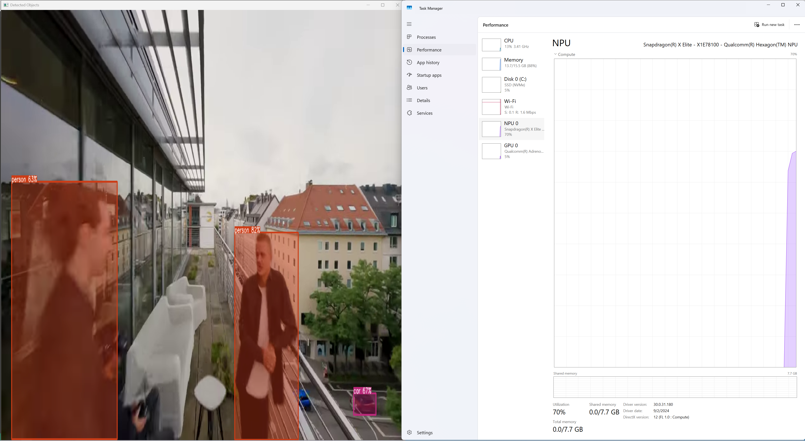

# Running Onnx-yolov8 Object Detection on QNN

- This is an example on how to create a QNN model and run it with [ONNX-YOLOv8-Object-Detection](https://github.com/ibaiGorordo/ONNX-YOLOv8-Object-Detection).

## Acknowledgements

- This project uses the [ONNX-YOLOv8-Object-Detection](https://github.com/ibaiGorordo/ONNX-YOLOv8-Object-Detection) repository by [ibaiGorordo](https://github.com/ibaiGorordo) for running the qnn model.

## Installation

### Create a Virtual Environment

1. Create a virtual environment:
    ```sh
    python -m venv venv
    ```

2. Activate the virtual environment:

    - On Windows:
        ```sh
        venv\Scripts\activate

3. Install the required packages:
    ```sh
    pip install -r requirements.txt
    ```

## Running the Notebook to Create a QNN Model

1. Open the Jupyter Notebook:
    ```sh
    jupyter notebook notebook.ipynb
    ```

2. Follow the instructions in the notebook to create the QNN model.

## Running ONNX-YOLOv8 Object Detection

1. Install the required packages:
    ```sh
    cd onnx-yolov8-object-detection
    pip install -r requirements.txt
    ```
2. Install the onnxruntime-qnn
    ```
    python -m pip install onnxruntime-qnn
    ```

2. Run the object detection scripts:

    - **Image inference**:
        ```sh
        python image_object_detection.py
        ```

    - **Webcam inference**:
        ```sh
        python webcam_object_detection.py
        ```

    - **Video inference**:
        ```sh
        python video_object_detection.py
        ```

# NPU Usage


## Additional Information

For more details, refer to the [ONNX-YOLOv8-Object-Detection README](ONNX-YOLOv8-Object-Detection/README.md).